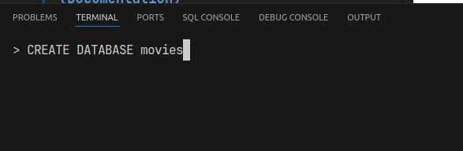
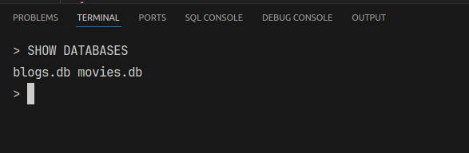
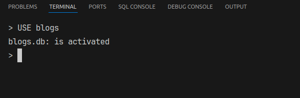
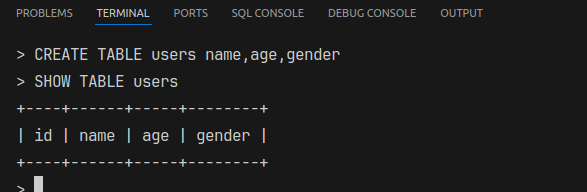
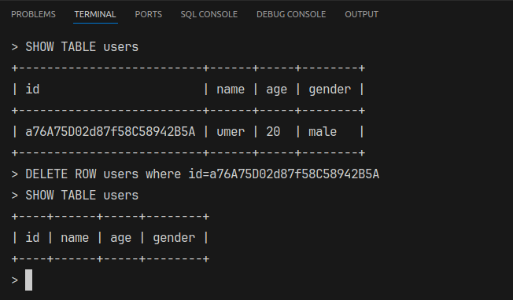
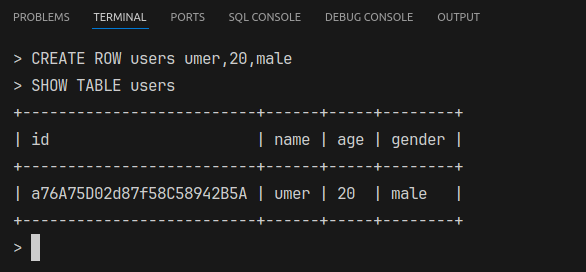
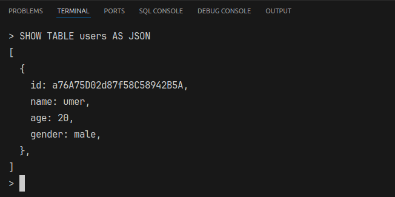

# Database Management System (Documentation)

## Collaborators

| ID          | Name    |
| ----------- | ------- |
| F2023266912 | M. Umer |

## Introduction

Created Database Management System with any libraries. It can handle following operations.

- Creating Multiple Databases
- Create Multiple Tables in single Database
- Create Multiple Rows in a single Table
- Show the tables as TABLE or JSON
- Relations can be added between multiple tables, like:
  - One to One
  - One to Many
  - Many to Many

## Create Database

`> CREATE DATABASE movies`

## Show All Databases

`> SHOW DATABASES`

## Select the current Database

`> USE blogs`

## Creating and Showing empty Table

`> CREATE TABLE users name,age,gender`
`> SHOW TABLE users`

## Delete row in the table

`> DELETE ROW users WHERE id=<id>`
`> SHOW TABLE users`

## Adding row in the table

`> CREATE ROW users umer,20,male`
`> SHOW TABLE users`

## Showing table as JSON

`> SHOW TABLE users AS JSON`

